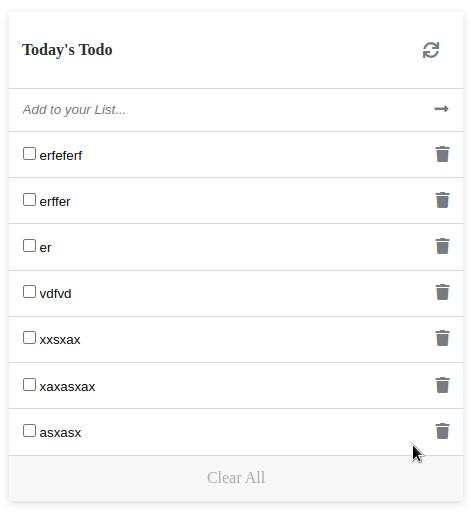

# Todo List Site

> This site enables one have track of the activities to be done daily.
# screenshot.

## Built With

 - html
 - javascript
 - Webpack
 
 ## Live Demo 
[To-do App](https://gordonotieno.github.io/todo-list/)

## Getting Started
 In order to use the files, you will need to clone it and then follow the instructions below: 
 
## Prerequisites
- Good Knowlege of html.
- Good knowledge of javascript.
- Familiar with webpack.
- Install nodejs then copy linters files from https://github.com/microverseinc/linters-config/tree/master/html-css-js

### Setup
Use 'git clone https://github.com/GordonOtieno/todo-list' to clone the repository to your local environment and begin working on it.
- run **'npm init'** to install dependancy packages.
- run **'npm run build'** to build the project and to generate dist files.
- run **'npm start'** to run you project in development mode.
 

## Author

👤 **Gordon Otieno**

- GitHub: [@GordonOtieno](https://github.com/GordonOtieno)
- Twitter: [@GordonO34459259](https://twitter.com/@GordonO34459259)

## 🤝 Contributing

Contributions, issues, and feature requests are welcome!

Feel free to check the [issues page](https://github.com/GordonOtieno/todo-list/issues).

## Acknowledgment 

Matt Shwery [@mshwery](https://web.archive.org/web/20190228042842/https://twitter.com/mshwery) for the Design used.
## Show your support

Give a ⭐️ if you like this project!

## 📝 License

This project is [MIT](./LICENSE) licensed.
